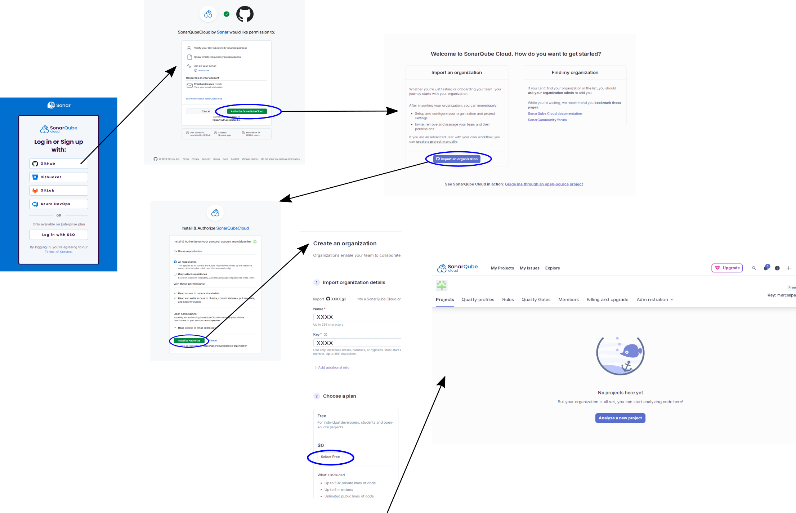
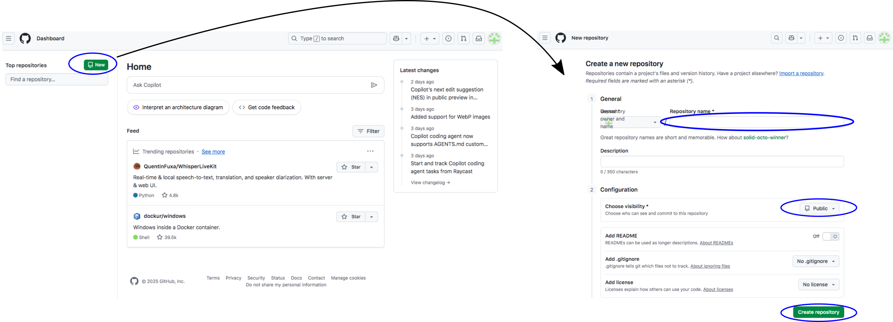
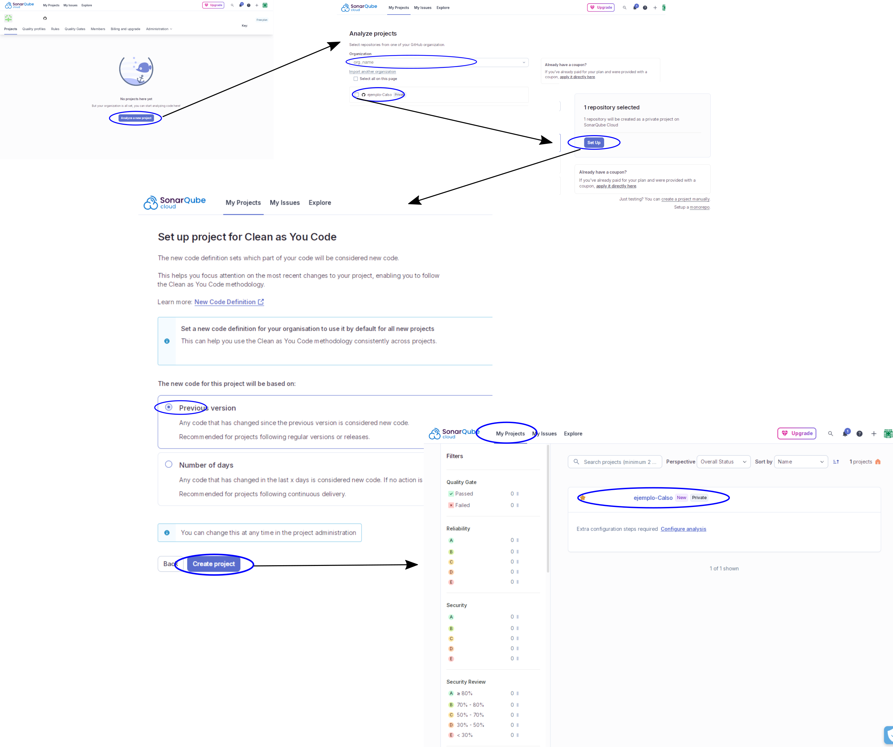
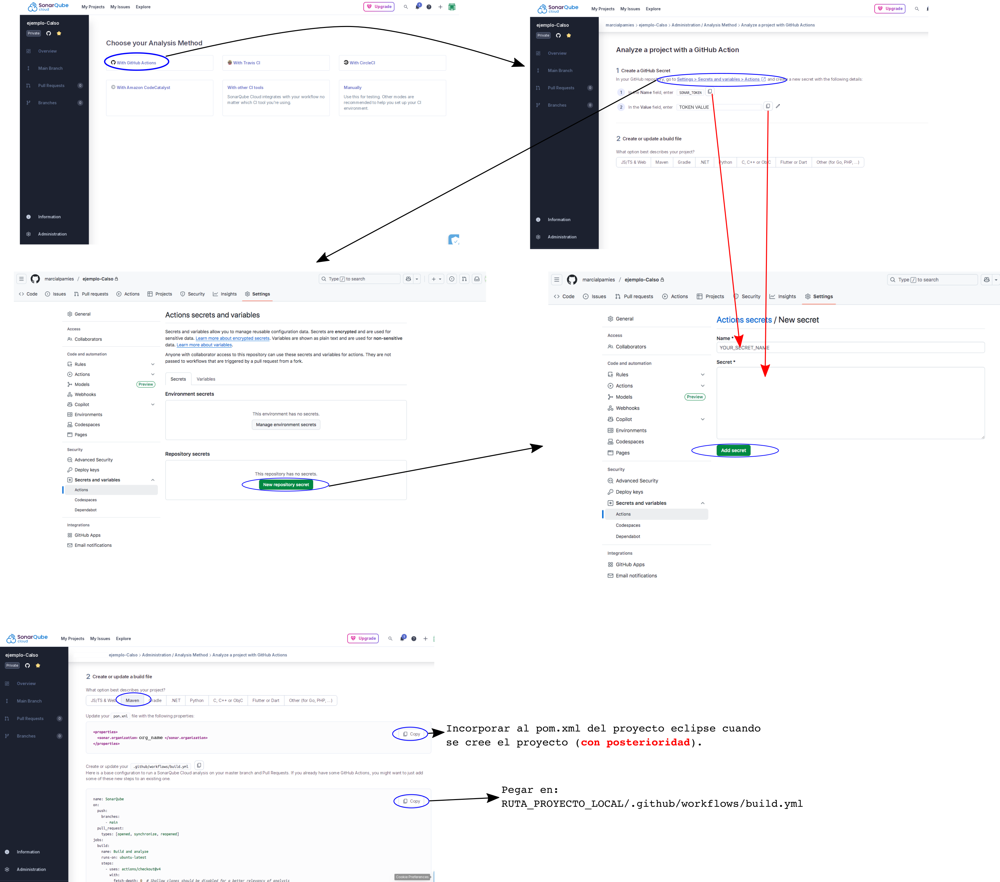

# Práctica 1: Revisiones estáticas de código con SonarCloud, SonarQube y GitHub
## 1. Objetivo
Introducir el uso de herramientas de análisis estático de código y su integración en el flujo de desarrollo de software, utilizando SonarQube Cloud como plataforma principal.

## 2. Introducción a las revisiones estáticas de código
Las **revisiones estáticas de código** consisten en analizar el software **sin ejecutarlo**, con el objetivo de detectar defectos, malas prácticas o riesgos de seguridad. Este tipo de análisis forma parte del proceso de **aseguramiento de la calidad** y permite localizar problemas en fases tempranas del desarrollo.

Entre los beneficios de la revisión estática destacan:
- Identificación de **bugs potenciales** (uso incorrecto de variables, estructuras incompletas, excepciones no tratadas).
- Control de **estilo y convenciones de codificación** (nombres de variables, estructura de clases, redundancias).
- Detección de **código duplicado** o mal estructurado.
- **Seguridad**: vulnerabilidades comunes como inyecciones o uso inseguro de librerías.
- Mejora de la **mantenibilidad** y reducción de la **deuda técnica**.

La automatización de este proceso es posible gracias a herramientas como **SonarQube**, que integran motores de análisis estático con la posibilidad de establecer métricas de calidad y gates (umbrales mínimos que el código debe cumplir antes de ser aceptado).

---

## 3. SonarQube Cloud: concepto y creación de una cuenta gratuita
**SonarQube Cloud** es la versión en la nube del servidor SonarQube. Permite:
- Analizar proyectos directamente conectados a repositorios de GitHub, GitLab, Azure DevOps o Bitbucket. En la versión gratuita con limitaciones
- Definir **Quality Profiles** (conjuntos de reglas activas) y **Quality Gates** (criterios de aceptación). En la versión gratuita se pueden definir pero el uso de los perfiles y criterios modificados solo está permitido si se adopta la versión de pago.
- Generar paneles de control con métricas de calidad, seguridad y cobertura de tests. Incluido en la versión gratuita.
- Integrar resultados de los análisis en los flujos de integración continua. Incluido en la ersión gratuita con limitaciones

### 3.1. Creación de cuenta en SonarQube Cloud
1. Si no se dispone de una, crearemos un cuenta de **GitHub**, usando la cuenta de correo del alumno que ejerce como coordinador del grupo. Accedemos a la cuenta de github. 
2. Con la cuenta de github abieta se accede a [https://sonarcloud.io/login](https://sonarcloud.io/login).  
3. Inicia sesión usando tu cuenta de **GitHub**.  
4. Autoriza a SonarCloud a acceder a tus repositorios. Durante este procedimiento importaremos una organización que coincidirá con el nombre del usuario propietario de la cuenta de GitHub utilizada.



---

## 4. Creación de un repositorio en GitHub y conexión con SonarCloud
Para automatizar el análisis en cada interacción con **GitHub**, necesitamos vincular nuestro repositorio en GitHub con un proyecto de análisis en SonarCloud.

### 4.1. Crear repositorio vacío en GitHub
1. Inicia sesión en [https://github.com](https://github.com).  
2. Clic en **New repository**.  
3. Define el nombre (ej. `CalSo2526-grupoXX`, donde XX representará el número de grupo).
4. Marca el repositorio como **Privado**  
5. No marques la opción de inicializar con README para evitar conflictos iniciales ni crees un fichero .gitignore.  
6. Copia la URL del repositorio (HTTPS).



### 4.2. Crear un proyecto de análisis y asociarlo a un repositorio de GitHub desde SonarCloud
1. En SonarCloud, dentro de tu organización, selecciona **Analyze new project**.  
2. Escoge el repositorio creado en GitHub y completa los pasos del proceso en las páginas sucesivas.  




### 4.3. Configurar el proyecto de SonarCloud y vincularlo con las acciones del repositorio de GitHub
1. Configurar el proyecto utilizando las acciones de GitHub. Este procedimiento proporcionará un **SONAR_TOKEN** para autenticar los análisis de las acciones.  
2. En el repositorio de GitHub:
   - Ve a **Settings > Secrets and variables > Actions**.
   - Crea un secreto llamado `SONAR_TOKEN` con el valor generado en el paso 1.
5. Añade un workflow de GitHub Actions:
   - Crear una carpeta que contenga el proyecto local (en nuestro ordenador)
   - Iniciar git en la carpeta local del proyecto y crear el archivo `build.yml` en la carpeta del proyecto local `.github/workflows`:
   ```shell
   cd RUTA_CARPETA_LOCAL_PROYECTO
   git init
   mkdir .github
   mkdir .github/workflows
   touch .github/workflows/build.yml
   ```
   - Copiar, en el archivo `.github/workflows/build.yml`, el contenido indicado, para un proyecto Maven, en el paso 2 de la configuración de SonarCloud (ver imagen siguiente)

  

  - Realizar el primer commit a nuestro repositorio remoto:
   ```shell
   cd RUTA_CARPETA_LOCAL_PROYECTO
   git config user.name "USERNAME" //Si no se tiene configurado.
   git config user.email "USER@EMAIL" //Si no se tiene configurado.
   git remote add origin https://github.com/... // Sustituir por la dirección de nuesttro repositorio.
   git branch -M main
   git add .
   git commit -m "Commit Inicial"
   git push -u origin main //Se solicitará el nombre de usuario y el token (clásico) de desarrollo de github.
   ```
   [Crear un token (clásico) de desarrollo de github](https://docs.github.com/es/authentication/keeping-your-account-and-data-secure/managing-your-personal-access-tokens#creating-a-personal-access-token-classic)

---

## 5. Creación de un proyecto Maven en Eclipse
- Descarga en la carpeta de nuetro proyecto local la carpeta que se encuentra en este repositorio nombrada como `p1-calso-25-26`. Esta carpeta contiene los archivos de proyecto Maven con el que trabajeremos en la práctica.
- Crea een la carpeta de tu repositorio local (no en la del proyecto Maven) el fichero `.gitignore` con el siguiente contenido mínimo:
```
# Compiled class file
*.class

# Log file
*.log

# BlueJ files
*.ctxt

# Mobile Tools for Java (J2ME)
.mtj.tmp/

# Package Files #
*.jar
*.war
*.nar
*.ear
*.zip
*.tar.gz
*.rar

/target/
/.metadata/
/.DS_Store

# virtual machine crash logs
hs_err_pid*
replay_pid*
```
- Abre el IDE de Eclipse y selecciona como workspace la carpeta de tu repositorio local (la carpeta que contiene `p1-calso-25-26`)
- Importa el proyecto Maven que se encuentra en la carpeta `p1-calso-25-26`

---

## 3. Plugin de SonarQube para Eclipse
Para trabajar en local con las **mismas reglas y configuraciones** que tengamos en SonarCloud, se utiliza el plugin oficial **SonarQube for IDE** (antes conocido como SonarLint).

### 3.1. Instalación
- En Eclipse: **Help > Eclipse Marketplace…**.  
- Buscar “SonarQube” e instalar **SonarQube for IDE**.  
- Reiniciar Eclipse.

### 3.2. Conexión con SonarCloud
1. Ir a **Window > Preferences > SonarQube > Connected Mode**.  
2. Crear una nueva conexión con **SonarCloud**.  
3. Autenticarse con un token personal de SonarCloud.  
4. Enlazar (bind) el proyecto local de Eclipse con su proyecto correspondiente en SonarCloud.  

De este modo, Eclipse descarga el **Quality Profile** activo en SonarCloud y lo aplica a los análisis locales.  
Al editar un fichero y guardar, los **issues** aparecen en la vista de SonarQube del IDE.


