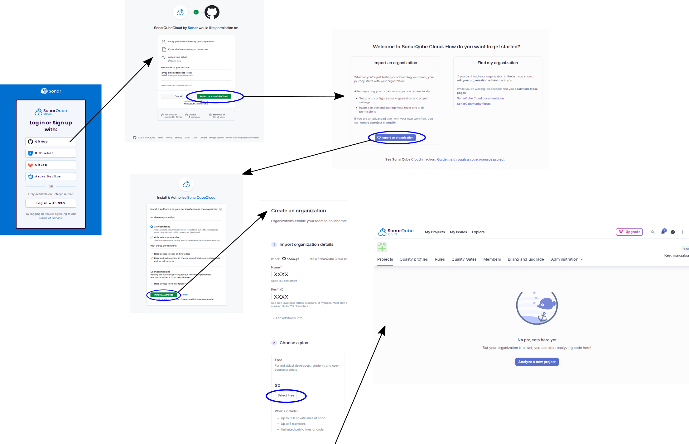
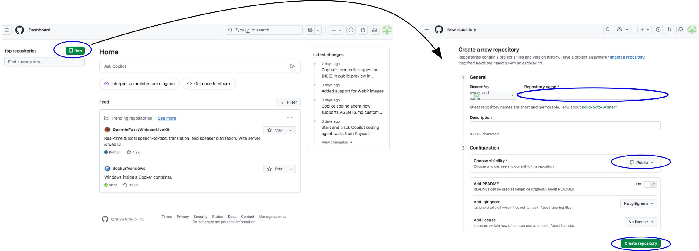
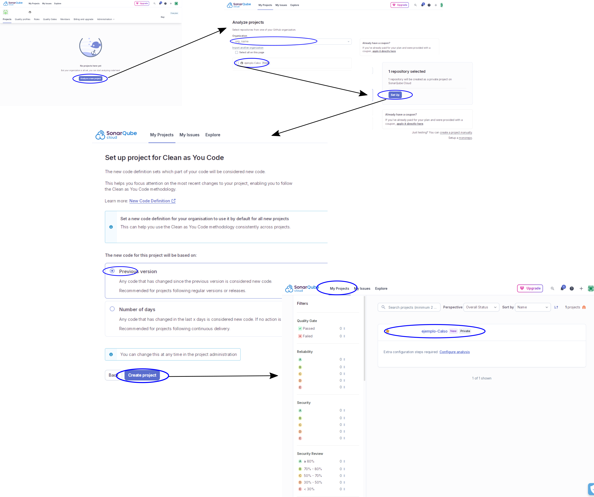

# Práctica 1: Revisiones estáticas de código con SonarCloud, SonarQube y GitHub
## 1. Objetivo
Introducir el uso de herramientas de análisis estático de código y su integración en el flujo de desarrollo de software, utilizando SonarQube Cloud como plataforma principal.

## 2. Introducción a las revisiones estáticas de código
Las **revisiones estáticas de código** consisten en analizar el software **sin ejecutarlo**, con el objetivo de detectar defectos, malas prácticas o riesgos de seguridad. Este tipo de análisis forma parte del proceso de **aseguramiento de la calidad** y permite localizar problemas en fases tempranas del desarrollo.

Entre los beneficios de la revisión estática destacan:
- Identificación de **bugs potenciales** (uso incorrecto de variables, estructuras incompletas, excepciones no tratadas).
- Control de **estilo y convenciones de codificación** (nombres de variables, estructura de clases, redundancias).
- Detección de **código duplicado** o mal estructurado.
- **Seguridad**: vulnerabilidades comunes como inyecciones o uso inseguro de librerías.
- Mejora de la **mantenibilidad** y reducción de la **deuda técnica**.

La automatización de este proceso es posible gracias a herramientas como **SonarQube**, que integran motores de análisis estático con la posibilidad de establecer métricas de calidad y gates (umbrales mínimos que el código debe cumplir antes de ser aceptado).

---

## 3. SonarQube Cloud: concepto y creación de una cuenta gratuita
**SonarQube Cloud** es la versión en la nube del servidor SonarQube. Permite:
- Analizar proyectos directamente conectados a repositorios de GitHub, GitLab, Azure DevOps o Bitbucket. En la versión gratuita con limitaciones
- Definir **Quality Profiles** (conjuntos de reglas activas) y **Quality Gates** (criterios de aceptación). En la versión gratuita se pueden definir pero el uso de los perfiles y criterios modificados solo está permitido si se adopta la versión de pago.
- Generar paneles de control con métricas de calidad, seguridad y cobertura de tests. Incluido en la versión gratuita.
- Integrar resultados de los análisis en los flujos de integración continua. Incluido en la ersión gratuita con limitaciones

### 3.1. Creación de cuenta en SonarQube Cloud
1. Si no se dispone de una, crearemos un cuenta de **GitHub**, usando la cuenta de correo del alumno que ejerce como coordinador del grupo. Accedemos a la cuenta de github. 
2. Con la cuenta de github abieta se accede a [https://sonarcloud.io/login](https://sonarcloud.io/login).  
3. Inicia sesión usando tu cuenta de **GitHub**.  
4. Autoriza a SonarCloud a acceder a tus repositorios. Durante este procedimiento importaremos una organización que coincidirá con el nombre del usuario propietario de la cuenta de GitHub utilizada.



---

## 4. Creación de un repositorio en GitHub para la práctica y conexión con SonarCloud
Para automatizar el análisis en cada interacción con **GitHub**, necesitamos vincular nuestro repositorio en GitHub con un proyecto de análisis en SonarCloud.

### 4.1. Crear repositorio vacío en GitHub
1. Inicia sesión en [https://github.com](https://github.com).  
2. Clic en **New repository**.  
3. Define el nombre (ej. `CalSo2526-grupoXX`, donde XX representará el número de grupo).
4. Marca el repositorio como **Privado**  
5. No marques la opción de inicializar con README para evitar conflictos iniciales ni crees un fichero .gitignore.  
6. Copia la URL del repositorio (HTTPS).



### 4.2. Crear un proyecto de análisis y asociarlo a un repositorio de GitHub desde SonarCloud
1. En SonarCloud, dentro de tu organización, selecciona **Analyze new project**.  
2. Escoge el repositorio creado en GitHub y completa los pasos del proceso en las páginas sucesivas.  




### 4.3. Configurar el proyecto de SonarCloud y vincularlo con las acciones del repositorio de GitHub
1. Configurar el proyecto utilizando las acciones de GitHub. Este procedimiento proporcionará un **SONAR_TOKEN** para autenticar los análisis de las acciones.  
2. En el repositorio de GitHub:
   - Ve a **Settings > Secrets and variables > Actions**.
   - Crea un secreto llamado `SONAR_TOKEN` con el valor generado en el paso 1.
5. Añade un workflow de GitHub Actions:
   - Crear una carpeta que contenga el proyecto local (en nuestro ordenador)
   - Iniciar git en la carpeta local del proyecto y crear el archivo `build.yml` en la carpeta del proyecto local `.github/workflows`:
   ```shell
   cd RUTA_CARPETA_LOCAL_PROYECTO
   git init
   mkdir .github
   mkdir .github/workflows
   touch .github/workflows/build.yml
   ```
   - Copiar, en el archivo `.github/workflows/build.yml`, el contenido indicado, para un proyecto Maven, en el paso 2 de la configuración de SonarCloud (ver imagen siguiente).
   - **IMPORTANTE:** Si en nuestro repositorio tenemos el proyecto maven (archivo pom.xml) dentro de una carpeta contenida en el repositorio (el archivo `pom.xml` no está en el directorio raiz de nuestro repositorio), por ejemplo en la carpeta `carpeta-poroy`, tendremos que añadir a la ejecución de maven la siguiente opción: `-f carpeta-proy/pom.xml`con el fin de que la acción encuentre el archivo del proyecto.

  

  - Realizar el primer commit a nuestro repositorio remoto:
   ```shell
   cd RUTA_CARPETA_LOCAL_PROYECTO
   git config user.name "USERNAME" //Si no se tiene configurado.
   git config user.email "USER@EMAIL" //Si no se tiene configurado.
   git remote add origin https://github.com/... // Sustituir por la dirección de nuesttro repositorio.
   git add .
   git commit -m "Commit Inicial"
   git branch -M main
   git push -u origin main //Se solicitará el nombre de usuario y el token (clásico) de desarrollo de github.
   ```
   [Crear un token (clásico) de desarrollo de github](https://docs.github.com/es/authentication/keeping-your-account-and-data-secure/managing-your-personal-access-tokens#creating-a-personal-access-token-classic)

---

## 5. Creación de un proyecto Maven en Eclipse
- Descarga en la carpeta de nuetro proyecto se encuentra en la subcarpeta de este repositorio nombrada como `p1-calso`. Esta carpeta contiene los archivos de proyecto Maven con el que trabajeremos en la práctica.
- Crea een la carpeta de tu repositorio local (no en la del proyecto Maven) el fichero `.gitignore` con el siguiente contenido mínimo:
```
### Eclipse ###
.metadata
bin/
tmp/
*.tmp
*.bak
*.swp
*~.nib
local.properties
.settings/
.loadpath
.recommenders

# External tool builders
.externalToolBuilders/

# Locally stored "Eclipse launch configurations"
*.launch


# CDT- autotools
.autotools

# Java annotation processor (APT)
.factorypath

# PDT-specific (PHP Development Tools)
.buildpath

# sbteclipse plugin
.target

# Tern plugin
.tern-project

# TeXlipse plugin
.texlipse

# STS (Spring Tool Suite)
.springBeans

# Code Recommenders
.recommenders/

# Annotation Processing
.apt_generated/
.apt_generated_test/

# Scala IDE specific (Scala & Java development for Eclipse)
.cache-main
.scala_dependencies
.worksheet

### Eclipse Patch ###
# Spring Boot Tooling
.sts4-cache/

### Java ###
# Compiled class file
*.class

# Log file
*.log

# BlueJ files
*.ctxt

# Mobile Tools for Java (J2ME)
.mtj.tmp/

# Package Files #
*.jar
*.war
*.nar
*.ear
*.zip
*.tar.gz
*.rar

# virtual machine crash logs, see http://www.java.com/en/download/help/error_hotspot.xml
hs_err_pid*
replay_pid*

### Linux ###
*~

# temporary files which can be created if a process still has a handle open of a deleted file
.fuse_hidden*

# KDE directory preferences
.directory

# Linux trash folder which might appear on any partition or disk
.Trash-*

# .nfs files are created when an open file is removed but is still being accessed
.nfs*

### macOS ###
# General
.DS_Store
.AppleDouble
.LSOverride

# Icon must end with two \r
Icon


# Thumbnails
._*

# Files that might appear in the root of a volume
.DocumentRevisions-V100
.fseventsd
.Spotlight-V100
.TemporaryItems
.Trashes
.VolumeIcon.icns
.com.apple.timemachine.donotpresent

# Directories potentially created on remote AFP share
.AppleDB
.AppleDesktop
Network Trash Folder
Temporary Items
.apdisk

### macOS Patch ###
# iCloud generated files
*.icloud

### Maven ###
target/
pom.xml.tag
pom.xml.releaseBackup
pom.xml.versionsBackup
pom.xml.next
release.properties
dependency-reduced-pom.xml
buildNumber.properties
.mvn/timing.properties
# https://github.com/takari/maven-wrapper#usage-without-binary-jar
.mvn/wrapper/maven-wrapper.jar

# Eclipse m2e generated files
# Eclipse Core
.project
# JDT-specific (Eclipse Java Development Tools)
.classpath

### Windows ###
# Windows thumbnail cache files
Thumbs.db
Thumbs.db:encryptable
ehthumbs.db
ehthumbs_vista.db

# Dump file
*.stackdump

# Folder config file
[Dd]esktop.ini

# Recycle Bin used on file shares
$RECYCLE.BIN/

# Windows Installer files
*.cab
*.msi
*.msix
*.msm
*.msp

# Windows shortcuts
*.lnk
```
- Abre el IDE de Eclipse y selecciona como workspace la carpeta de tu repositorio local (la carpeta que contiene `p1-calso`)
- Importa el proyecto Maven que se encuentra en la carpeta `p1-calso`

---

## 6. Plugin de SonarQube para Eclipse
Para trabajar en local con las **mismas reglas y configuraciones** que tengamos en SonarCloud, se utiliza el plugin oficial **SonarQube for IDE** (antes conocido como SonarLint).

### 6.1. Instalación del pulgin
- En Eclipse: **Help > Eclipse Marketplace…**.  
- Buscar “SonarQube” e instalar **SonarQube for IDE**.  
- Reiniciar Eclipse.

### 3.2. Conexión con SonarCloud
1. En **Eclipse**, Ir a *Window > Preferences > SonarQube > Connected Mode*.  
2. Crear una nueva conexión con **SonarCloud**.  
3. Autenticarse con un token personal de SonarCloud.  
4. Enlazar (bind) el proyecto local de Eclipse con su proyecto correspondiente en SonarCloud.  

De este modo, Eclipse descarga el **Quality Profile** activo en SonarCloud y lo aplica a los análisis locales.  Al editar un fichero y guardar, los **issues** aparecen en la vista de SonarQube del IDE.

---
## 7. Forma de trabajo

Cada miembro del grupo trabajará sobre su propia rama del repositorio de trabajo del grupo. Tened en cuenta que cada rama deberá tener su propio build.yml para indicar la versión que se deberá ejecutar al hacer push a sus respectivas ramas. En función del análisis inicial del código el grupo de trabajo se repartirá el código para resolver y documentar las acciones para resolver las disconformidades que se encuentran en el código. Cada resolución conllevará un commit a la rama correspondiente.


